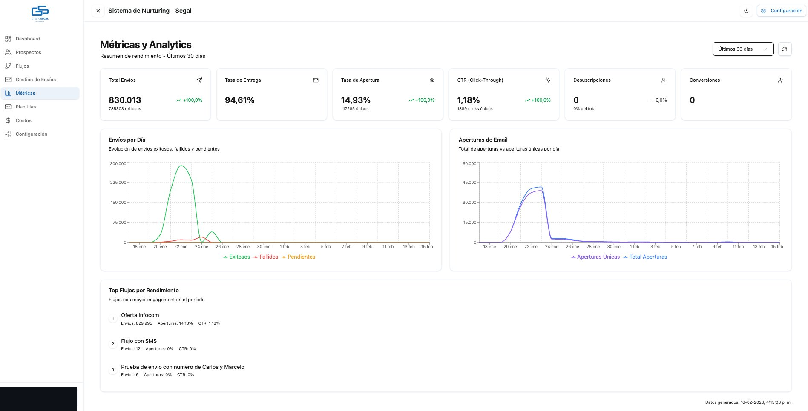
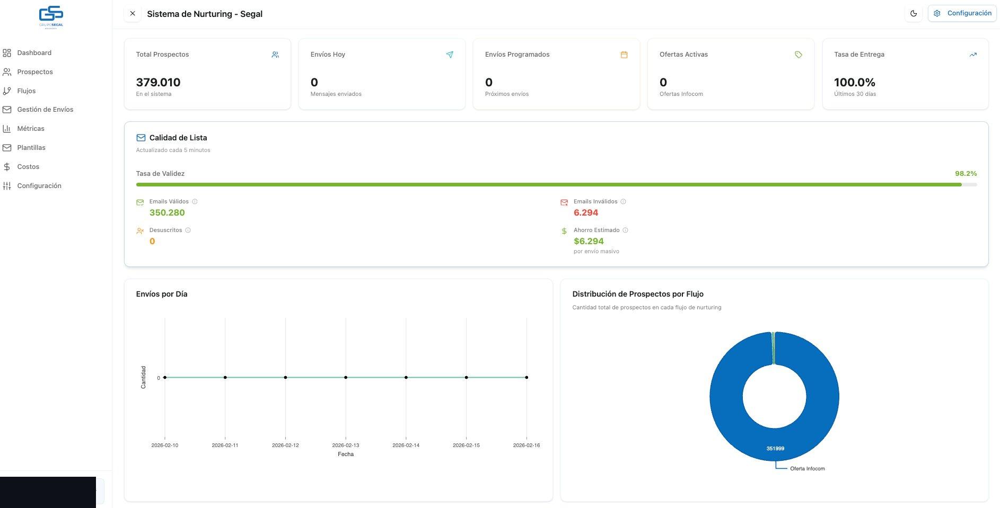
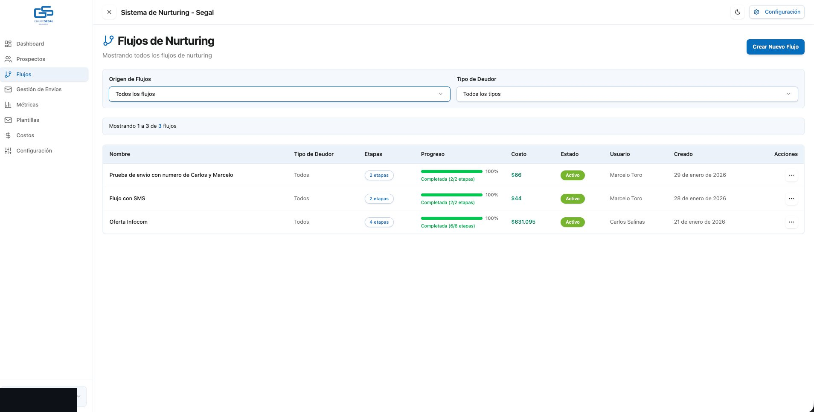
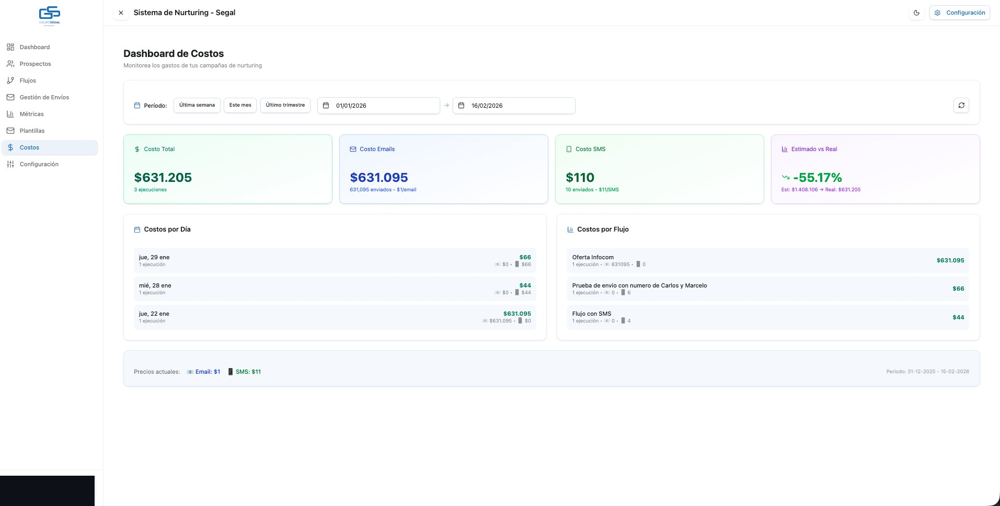

# Nurturing CRM

Custom CRM platform with automated email and SMS marketing workflows for high-volume campaigns.

> 🔒 Source code available for technical review upon request (NDA required)

## Overview

Built for a legal services company in Chile to manage client relationships (prospectos) and automate multi-channel marketing at scale. I led the full-stack development of this system.

## Results

| Metric | Value |
|--------|-------|
| Total emails sent | 830,013 |
| Delivery rate | 94.61% |
| Open rate | 14.93% |
| Click-through rate | 1.18% |
| Contacts managed | 379,000+ |
| Email validation rate | 98.2% |
| Cost savings vs estimated | -55% |

## Screenshots

### Métricas y Analytics

*Real-time campaign performance: delivery rates, opens, clicks, and daily trends*

### Dashboard Principal

*Overview with 379K contacts, email validation status, and send volume by day*

### Flujos de Nurturing

*Multi-stage automation workflows with progress tracking and cost per flow*

### Dashboard de Costos

*Cost monitoring per campaign: $1/email, $11/SMS, with estimated vs actual comparison*

## Tech Stack

### Frontend
- React 19
- TypeScript
- Tailwind CSS
- Shadcn UI
- TanStack Query (React Query)
- Recharts (data visualization)

### Backend
- Laravel 12
- PHP 8.3
- PostgreSQL
- Redis (queues & caching)

### Infrastructure
- Google Cloud Platform
- Docker
- GitHub Actions (CI/CD)

## Architecture

```
┌─────────────────────────────────────────────────────────────────┐
│                         FRONTEND                                 │
│                    React + TypeScript                            │
└─────────────────────────┬───────────────────────────────────────┘
                          │ REST API
                          ▼
┌─────────────────────────────────────────────────────────────────┐
│                      LARAVEL API                                 │
│  ┌─────────────┐  ┌─────────────┐  ┌─────────────┐              │
│  │ Controllers │  │  Services   │  │    Jobs     │              │
│  └─────────────┘  └─────────────┘  └──────┬──────┘              │
└───────────────────────────────────────────┼─────────────────────┘
                          │                 │
          ┌───────────────┼─────────────────┼───────────────┐
          ▼               ▼                 ▼               ▼
    ┌──────────┐   ┌──────────┐      ┌──────────┐    ┌──────────┐
    │PostgreSQL│   │  Redis   │      │  Redis   │    │SMTP / SMS│
    │   (DB)   │   │ (Cache)  │      │ (Queues) │    │ Providers│
    └──────────┘   └──────────┘      └──────────┘    └──────────┘
```

## Key Features

### 📊 Métricas y Analytics
- Real-time delivery tracking (sent, delivered, bounced)
- Open and click-through rate monitoring
- Daily send volume charts
- Top performing flows ranking

### 👥 Gestión de Prospectos
- Import contacts via Excel/CSV (350K+ records per batch)
- Email validation with 98.2% accuracy
- Segmentation by status, debt type, and custom fields
- Bulk export functionality

### 🔄 Flujos de Nurturing
- Multi-stage automation workflows (2-6 stages)
- Progress tracking per flow
- Cost estimation per execution
- Support for both Email and SMS channels

### 💰 Dashboard de Costos
- Real-time cost tracking per campaign
- Email ($1) and SMS ($11) pricing
- Estimated vs actual cost comparison
- Historical cost analysis by period

### ⚙️ Technical Highlights
- Queue-based processing for 830K+ emails
- 94.61% delivery rate optimization
- Email validation before sending (saves ~$6,294 per campaign)
- Multi-tenant ready architecture

## Video Walkthrough

🎥 [Watch 5-minute demo](#) *(coming soon)*

## Contact

**Marcelo Toro**  
Senior Full Stack Developer

- 📧 mtoro6@gmail.com
- 💼 [LinkedIn](https://linkedin.com/in/marcelo-toro-toro)
- 🌐 [Portfolio](https://marcelo-toro-portfolio.netlify.app/)

---

*Source code available for technical review during interview process.*
